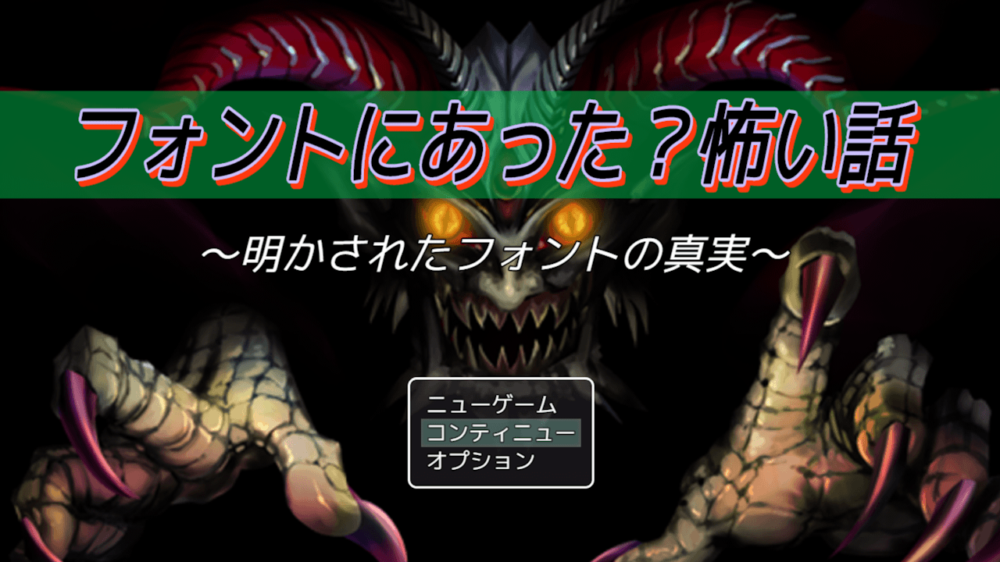

# タイトル文字修飾プラグイン（NLM_TitleFont.js）
### RPGツクールMZ/MV両用プラグイン

タイトル文字を簡易的に色々修飾できます  
　サイズ、カラー、縁取り、太字、斜字、フォントファイル、影付き文字、背面帯、サブタイトルなどを パラメータで変えられます

# download

プラグインの download は、[右クリック「名前を付けてリンク先を保存」](https://raw.githubusercontent.com/nolimits-tukool/NLM_TitleFont/refs/heads/main/NLM_TitleFont.js)  
RPGツクールMZ/MV両用です

# license

　MITライセンスの通りです

## [リポジトリ 一覧へ](https://github.com/nolimits-tukool?tab=repositories)
